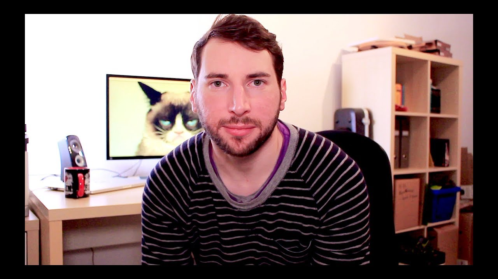

# Episode 0 - Humble Beginnings

This is the very first episode of "Hello Rust!". I'm so excited!

It is my lighthearted journey to become a fearless, more effective Rust programmer. And you can be part, too! My goal is to address beginner and intermediate Rust questions and show that systems programming can be a lot of fun. In this episode, I talk about the show and how I started with Rust. The show is clearly inspired by "JustForFunc" and "Fun Fun Function".

[Watch now on Youtube!](https://youtu.be/jMJRTjnh_jo)  

If you like to get notified about new episodes, [please subscribe to my channel](https://www.youtube.com/hellorust) 😊.

Keywords: introduction, rustlang, live-coding

## Things I mentioned during the show

* [Steve Klabnik - The History of Rust, 2015](https://www.youtube.com/watch?v=79PSagCD_AY)
* [My Blog, where it all started](http://matthias-endler.de/)
* [Rust Cologne - Our monthly meetup](http://www.meetup.com/de/Rust-Cologne-Bonn/)

## Things I should have mentioned (but forgot)

* I was clearly inspired by the following shows:
* [Just for func](https://www.youtube.com/channel/UC_BzFbxG2za3bp5NRRRXJSw)
* [fun fun function](https://www.youtube.com/channel/UCO1cgjhGzsSYb1rsB4bFe4Q)

## Resources and licenses

* Wallpaper: [Grumpy Cat](https://www.tineye.com/search/4e3d2800ae44015cce4a5ee5e04b94226cae14ba/)

## Support!

Preparing, recording, and editing an episode takes a substantial amount of time
(around 30 hours total). I do all of this next to my fulltime dayjob.
If you want to show your appreciation and help me keep the content free
for everybody to enjoy, [please consider supporting me on
Patreon](https://www.patreon.com/bePatron?c=1568097) - no matter the amount. ❤️