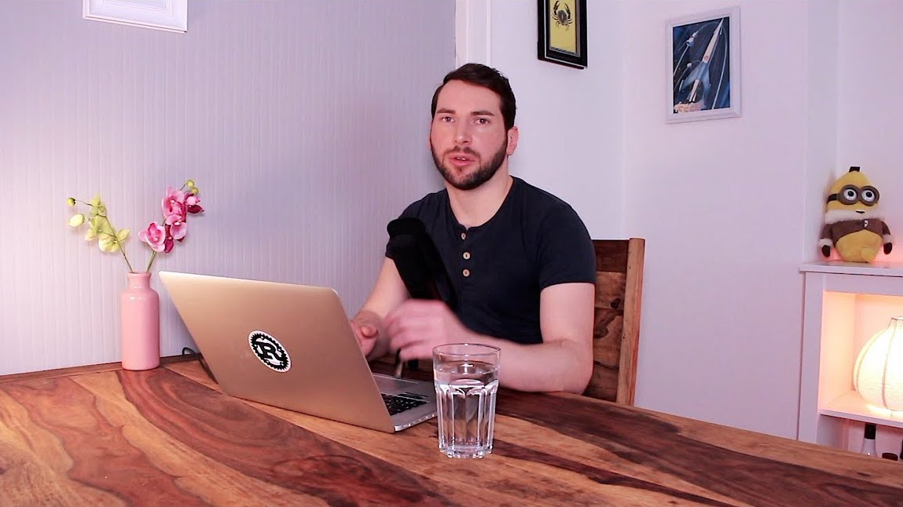

# Episode 1 - Hello Universe

This is the very first real coding episode of "Hello Rust!".
  
Today we will write *hello world*, but by leveraging the builder pattern to support different languages (hence the title "Hello Universe").
  

[Watch now on Youtube!](https://www.youtube.com/watch?v=STWuPMcwwbw)  

Keywords: default trait, debug trait, builder pattern

## Things I mentioned during the show

* [Kernighan & Ritchie - The C Programming Language](https://en.wikipedia.org/wiki/The_C_Programming_Language)
* [Default trait](https://doc.rust-lang.org/std/fmt/trait.Default.html)
* [Debug trait](https://doc.rust-lang.org/std/fmt/trait.Debug.html)

## Things I should have mentioned (but forgot)

* [Test organization using `super::*`](https://doc.rust-lang.org/book/second-edition/ch11-03-test-organization.html)

## Meta

* Colorscheme: [1337](https://github.com/MarkMichos/1337-Scheme)

## Support!

If you liked this video, [please subscribe to my channel](https://www.youtube.com/channel/UCZ_EWaQZCZuGGfnuqUoHujw) 😊.
You will not regret this, I guess.
If you're really digging this thing, [show your support on Patreon](https://www.patreon.com/bePatron?c=1568097).  
Thank you very much for considering a donation - no matter the amount.
