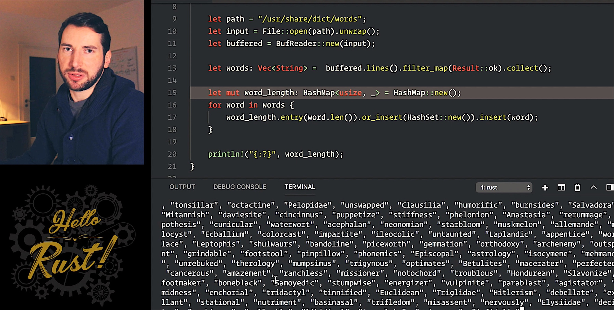

# Episode 2 - Snakes And Gears

**[&#x25b6; Watch now on Youtube!](https://youtu.be/bS5rtxWd2yQ)**

Let's talk about Python and Rust. I used to do a lot more Python than I do now, but I still love it for its beauty.  

One of the first things I was missing in Rust when coming from Python were List Comprehensions.   It took me a while to figure out, that the Rust way - using iter(), filter(), and map() - actually is a better fit for the language.   I want to show you how to port Rust list comprehensions to Rust.

If you like to get notified about new episodes, [please subscribe to my channel](https://www.youtube.com/hellorust) 😊.

Keywords: iterators, map, filter, Entry API, List comprehensions

## Things I mentioned during the show

* Reading files using the [Rust Cookbook](https://rust-lang-nursery.github.io/rust-cookbook/file/read-write.html#read-lines-of-strings-from-a-file).
* [DevDocs](http://devdocs.io/) is a nice Rust documentation viewer. Also supports a ton of other languages and works offline.

## Things I should have mentioned (but forgot)

* [Iteration patterns for Result & Option](http://xion.io/post/code/rust-iter-patterns.html)
* Experimenting with Python is much cooler with [Jupyter](http://jupyter.org/) (or IPython) notebooks. I've added an example to the code section.
* If you really **need** list comprehensions, you could use [cute](https://crates.io/crates/cute), which is a set of macros that make this syntax possible.

## Meta

* Colorscheme: [Gruvbox Dark](https://github.com/morhetz/gruvbox)

## Resources and licenses

* Intro song: Aries Beats - Night Ride (https://www.youtube.com/watch?v=AOvr_57BMZo)

## Support!

Preparing, recording, and editing an episode takes a substantial amount of time
(around 30 hours total). I do all of this next to my fulltime dayjob.
If you want to show your appreciation and help me keep the content free
for everybody to enjoy, [please consider sponsoring me on
Github](https://github.com/sponsors/mre/) - no matter the amount. ❤️