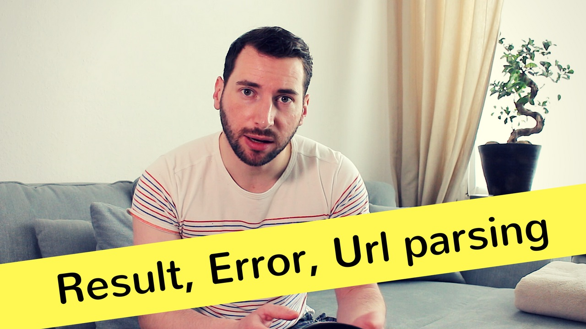

# Episode 3 - A Code Review

Today we will do our first code review. 

I picked a library from my colleague [Luca Pizzamiglio](https://github.com/pizzamig/) called [repoctl](https://github.com/pizzamig/repoctl), which is a tool for handling FreeBSD package files in Rust. The goal is to improve the codebase and make it more robust and idiomatic.

[Watch now on Youtube!](https://youtu.be/a6KWRvAPsmo)  

If you like to get notified about new episodes, [please subscribe to my channel](https://www.youtube.com/hellorust) 😊.

Keywords: Option, Result, Error handling, URL parsing, external crates

## Things I mentioned during the show

* [repoctl main repository](https://github.com/pizzamig/repoctl)
* [repoctl pull request from the episode](https://github.com/pizzamig/repoctl/pull/1)
* [autoconf documentation](https://www.gnu.org/software/autoconf/autoconf.html)
* [UCL - the Universal Configuration Language](https://github.com/vstakhov/libucl)
* [Rust bindings for UCL](https://github.com/hauleth/ucl-rs)
* [URL crate](https://crates.io/crates/url)
* [Rust RFC - Clarify and streamline paths and visibility](https://github.com/rust-lang/rust/issues/44660) 

## Things I should have mentioned (but forgot)

* You should definitely create a pull request to repoctl! Luca and me will support you if we can. Below are some ideas.
* Replace things like `fuf` and `fuf2` in the tests with a data provider
* Use `unwrap_or_default()` where useful
* Run [clippy](https://github.com/rust-lang-nursery/rust-clippy) on the project and fix all code smells.
* Somebody should implement [`Default`](https://doc.rust-lang.org/std/default/trait.Default.html) for [`Repository`](https://github.com/pizzamig/repoctl/blob/master/src/repository/mod.rs#L9).

## Resources and licenses

* [Elevator sound](https://freesound.org/people/omarie/sounds/382447/)
* [Comic whistle sound](https://freesound.org/people/InspectorJ/sounds/410803/)
* [Swoosh sound](https://freesound.org/people/martian/sounds/19312/)

## Support!

Preparing, recording, and editing an episode takes a substantial amount of time
(around 30 hours total). I do all of this next to my fulltime dayjob.
If you want to show your appreciation and help me keep the content free
for everybody to enjoy, [please consider supporting me on
Patreon](https://www.patreon.com/bePatron?c=1568097) - no matter the amount. ❤️