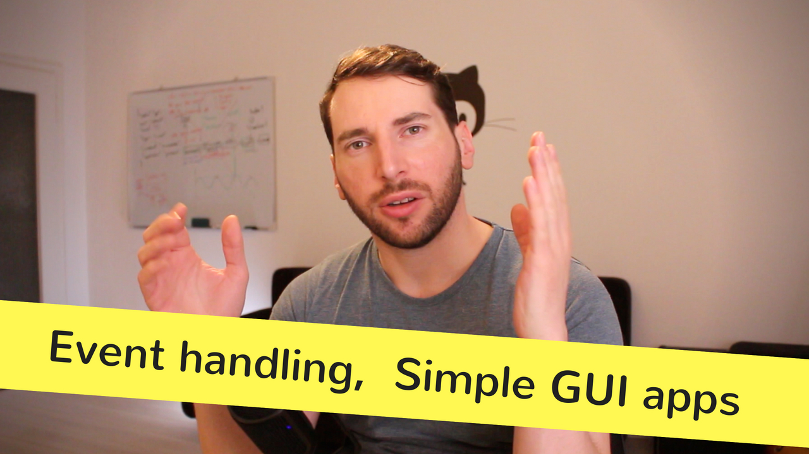

# Episode 4 - Touch Typing Tutor

I hack on a small application that will help me get better at touch typing.

Not a tutorial, but just a fun hacking session to build a touch typing application using ggez - a game framework written in Rust.

[Watch now on Youtube!](https://youtu.be/S0Vubd-C5-o)  

Keywords: touch typing, application, ggez, event handling, game state, iterators, hacking, live-coding

## Things I mentioned during the show

* [ggez on Github](https://github.com/ggez/ggez)
* [ggez homepage](http://ggez.rs/)
* [Type racer](http://typeracer.com/)
* [keybr](http://keybr.com/)

## Meta

* My Keyboard: [Durgod Taurus K320](https://www.aliexpress.com/item/durgod-87-taurus-k320-mechanical-keyboard-using-cherry-mx-switches-pbt-doubleshot-keycaps-brown-blue-black/32845509908.html) (Cherry MX Brown keys + O-Rings)

## Resources and licenses

* I've used sound effects from [free sound pack by Setuniman](https://freesound.org/people/Setuniman/packs/8199/)
* [Curious by Setuniman](https://freesound.org/people/Setuniman/sounds/154907/) available at https://freesound.org/s/154907/
* Plop sound by [HerbertBoland](https://freesound.org/people/HerbertBoland/sounds/33369/)

## Support!

If you liked this video, [please subscribe to my channel](https://www.youtube.com/channel/UCZ_EWaQZCZuGGfnuqUoHujw) 😊.
You will not regret this, I guess.
If you're really digging this thing, [show your support on Patreon](https://www.patreon.com/bePatron?c=1568097).  
Thank you very much for considering a donation - no matter the amount.
