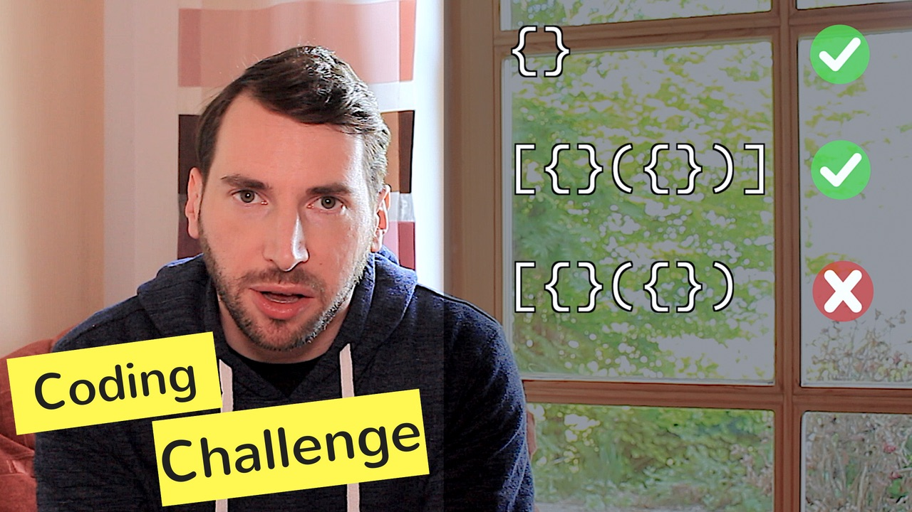

# Episode 5 - Coding Challenge - Balanced Brackets

Today we will do a quick interview question called "balanced brackets"
  
I maintain a list of common interview questions on Github, that is perfect for some quick fun exercise from time to time. In this case I'd like to introduce you to a task called "balanced brackets", which is some sort of state machine, to check if an input consisting of brackets has exactly one closing bracket for each opening bracket.
  

[Watch now on Youtube!](https://youtu.be/XcuLHO8z_RA)  

Keywords: Into trait, Pattern matching, HashMap, Stack, unreachable! macro, coding puzzle, competitive programming

## Things I mentioned during the show

* Unreachable macro: https://doc.rust-lang.org/std/macro.unreachable.html
* Into trait: https://doc.rust-lang.org/std/convert/trait.Into.html
* Creating a Rust function that accepts String or &str: https://hermanradtke.com/2015/05/06/creating-a-rust-function-that-accepts-string-or-str.html

## Things I should have mentioned (but forgot)

* Thanks to @barskern who [found a major bug in the code](https://github.com/hello-rust/show/blob/master/episode/5/balanced/src/lib.rs)
* More coding puzzles at [my Github repository](https://github.com/mre/the-coding-interview)

## Meta

* Bavarian Seaside by [KevinMacLeod](https://soundcloud.com/kevin-9-1/bavarian-seascape)
* Coin sound by [ProjectsU012](https://freesound.org/people/ProjectsU012/sounds/341695/)
* Blip sound by [ProjectsU012](https://freesound.org/people/ProjectsU012/sounds/341024/)
* Mystery sound by [FoolBoyMedia](https://freesound.org/people/FoolBoyMedia/sounds/256099/#)

## Support!

If you liked this video, [please subscribe to my channel](https://www.youtube.com/channel/UCZ_EWaQZCZuGGfnuqUoHujw) 😊.
You will not regret this, I guess.
If you're really digging this thing, [show your support on Patreon](https://www.patreon.com/bePatron?c=1568097).  
Thank you very much for considering a donation - no matter the amount.
