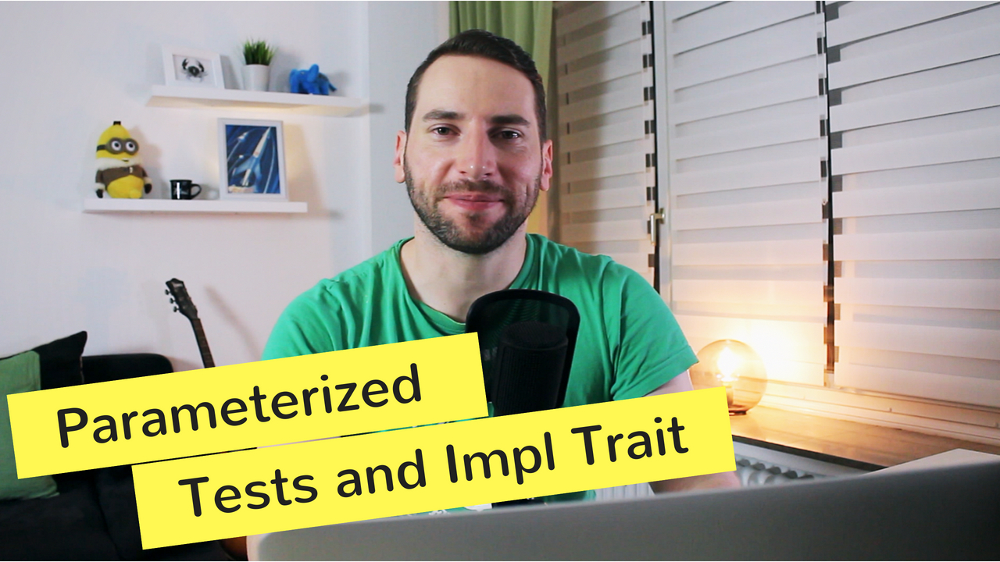

# Episode 6 - Parameterized Tests, Macros, And Refactoring

**[&#x25b6; Watch now on Youtube!](https://youtu.be/XJPci7GI-qg)**

Let's fix a bug in my balanced brackets code and learn a few things about test organization and traits
There's some stuff to improve in my coding puzzle code from last time, balanced brackets. Can you spot the bug and fix it? I'll show you what's wrong and an idiomatic way to solve the problem.

If you like to get notified about new episodes, [please subscribe to my channel](https://www.youtube.com/hellorust) 😊.

Keywords: Test data providers, Parameterized tests, AsRef trait, Macros

## Things I mentioned during the show

* [AsRef trait](https://doc.rust-lang.org/std/convert/trait.AsRef.html)
* [Discussion around Into, AsRef and Cow](https://users.rust-lang.org/t/idiomatic-string-parmeter-types-str-vs-asref-str-vs-into-string/7934/4)
* [Macros in Rust](https://doc.rust-lang.org/book/second-edition/appendix-04-macros.html)

## Resources and licenses

* Comic suspense sound by tyops: https://freesound.org/people/tyops/sounds/347221/
* Background music: [Juanitos - Hola_Hola_Bossa_Nova](http://freemusicarchive.org/music/Juanitos/)

## Support!

Preparing, recording, and editing an episode takes a substantial amount of time
(around 30 hours total). I do all of this next to my fulltime dayjob.
If you want to show your appreciation and help me keep the content free
for everybody to enjoy, [please consider supporting me on
Patreon](https://www.patreon.com/bePatron?c=1568097) - no matter the amount. ❤️