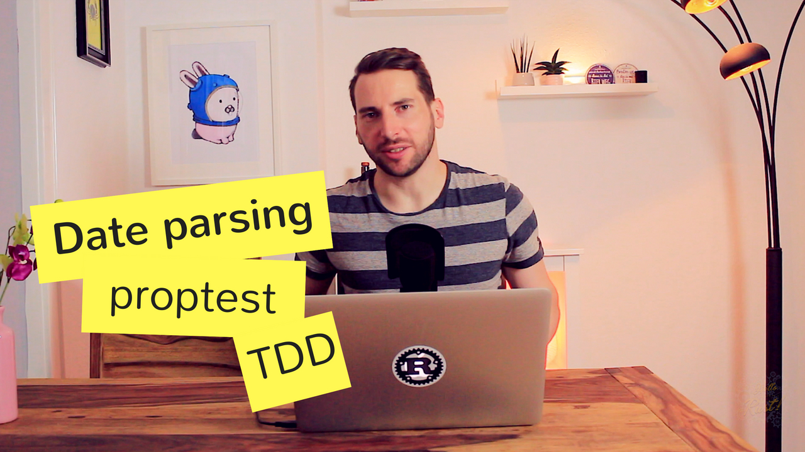

# Episode 7 - Parsing Dates Using Proptest And Tdd

Testing is hard, as can be seen in the last two episodes. That's why I looked around for better alternatives and found proptest.
Let's take a look at proptest, a library for automatically generating testcases similar to quickcheck (of Haskell fame). We will parse informal english dates like "4th of September 1927" using Proptest and TDD.

[Watch now on Youtube!](https://youtu.be/zb7SD0Jco6g)  

Keywords: Property testing, Quickcheck, Unit testing, Fuzzy testing, TDD

## Things I mentioned during the show

* [Proptest](https://github.com/AltSysrq/proptest) crate by Jason Lingle
* [Quickcheck crate for Rust](https://github.com/BurntSushi/quickcheck) by Andrew Gallant
* [History of quickcheck](https://en.wikipedia.org/wiki/QuickCheck)
* [Chrono english crate](https://github.com/stevedonovan/chrono-english) by Steve J Donovan

## Errata

It might come to you as a surprise, but every once in a while even I make a mistake.  
This section covers all improvements made to the code since the epsiode went live.  
For an exhaustive list of all changes to the original code, [go here](https://github.com/hello-rust/show/commits/master/episode/8).
Thanks to all contributors!  

* [vikrrrr](https://github.com/vikrrrr) found [a beautiful way to parse the month using Option::map](https://github.com/hello-rust/show/pull/42).

## Meta

* I prefer to use `ok_or_else` as `ok_or` evaluates eagerly and [might get deprecated](https://github.com/rust-lang/rust/issues/51292)

## Resources and licenses

* Pizzicato by Setuniman: https://freesound.org/people/Setuniman/sounds/149827/
* Lynx pizzicanto by filmistro: https://filmstro.com/music/pizzicato-strings
* Bug image: https://www.freepik.com/free-vector/funny-insects-icon-set_1488662.htm#term=bug&page=1&position=9

## Support!

If you liked this video, [please subscribe to my channel](https://www.youtube.com/channel/UCZ_EWaQZCZuGGfnuqUoHujw) 😊.
You will not regret this, I guess.
If you're really digging this thing, [show your support on Patreon](https://www.patreon.com/bePatron?c=1568097).  
Thank you very much for considering a donation - no matter the amount.
