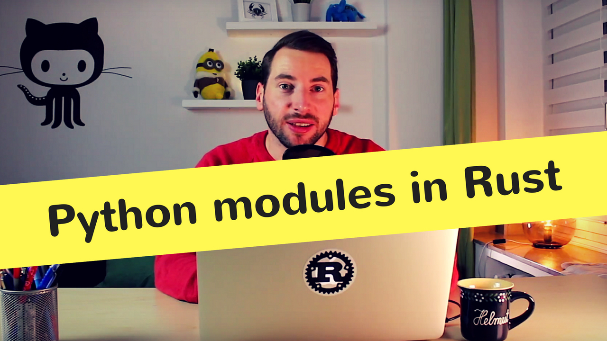

# Episode 8 - Let'S Write A Python Module!

Today, I want to show you how to write a Python extension in Rust using pyo3.
I like tinkering with programming languages and making things faster. What's cooler than combining those two things? With Rust you can write safe, fast extensions for dynamically typed programming languages like Python, PHP, or Ruby. That's why today i'd like to show you how to write a Python extension from scratch!

[Watch now on Youtube!](https://youtu.be/D9r__qxtRMQ)  

If you like to get notified about new episodes, [please subscribe to my channel](https://www.youtube.com/hellorust) 😊.

Keywords: Tutorial, FFI, pyo3, Module, Extension, Python

## Things I mentioned during the show

* A nightly compiler is required. You can use [rustup](https://rustup.rs/) to install it.
* To use your compiled module, run the Python interpreter outside of the project folder.
* Here are a few ideas for your own module: Write a regex module based on Rust's re or write a str.replace method.
* If you like this stuff check out [hyperjson](https://github.com/mre/hyperjson), a json module I wrote in Rust.
* setup.py (for humans): https://github.com/kennethreitz/setup.py.

## Errata and improvements

It might come as a surprise to you, but every once in a while *even I* make a mistake.  
This section covers all improvements made to the code since the epsiode went live.  
For an exhaustive list of all changes to the original code, [go here](https://github.com/hello-rust/show/commits/master/episode/8).
Thanks to all contributors!  

* Update code to work with latest version of pyo3; formatting and cleanup for stabilizations. See [changes here](https://github.com/hello-rust/show/pull/47).

## Meta

* Visual Studio Code Theme: Monokai

## Resources and licenses

* B-Roll: Computer And The Mind Of Man Pt 3, The Universal Machine: https://archive.org/details/ComputerAndTheMindOfManP3TheUniversalMachine.
* Radio static by LimitSnap_Creations: https://freesound.org/people/LimitSnap_Creations/sounds/279003/.
* silent movie 0M_34pi by Setuniman: https://freesound.org/people/Setuniman/sounds/153470/.
* 'Absurd' by David Fesliyan from http://fesliyanstudios.com/.
* 'Moron' by David Fesliyan from http://fesliyanstudios.com/.
* Baddum Tish - Comedy Rimshots.wav by rodincoil: https://freesound.org/people/rodincoil/sounds/271208/.

## Support!

Preparing, recording, and editing an episode takes a substantial amount of time
(around 30 hours total). I do all of this next to my fulltime dayjob.
If you want to show your appreciation and help me keep the content free
for everybody to enjoy, [please consider supporting me on
Patreon](https://www.patreon.com/bePatron?c=1568097) - no matter the amount. ❤️