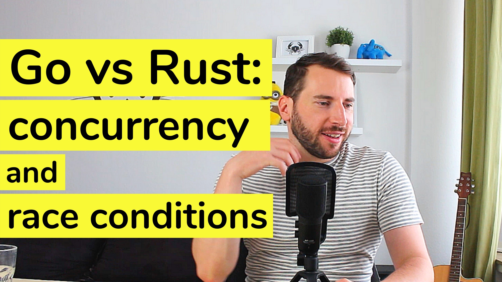

# Episode 9 - Go Vs Rust - Concurrency And Race Conditions

It's hard to put into words what I like about Rust. Easier to show with a quick example about concurrency and borrowing.
Capturing the "Magic of Rust" is not easy. Luckily, I found a simpler way: show how Rust prevents race-conditions and guides us towards a safe, idiomatic solution. We will port  a little Go CLI tool to Rust and compare both solutions in terms of safety, error handling, and concurrency patterns.

[Watch now on Youtube!](https://youtu.be/B5xYBrxVSiE)  

If you like to get notified about new episodes, [please subscribe to my channel](https://www.youtube.com/hellorust) 😊.

Keywords: race-conditions, ownership, mutex, concurrency, rayon, golang, rustlang

## Things I mentioned during the show

* Go in Practice book by Matt Butcher and Matt Farina (Manning Publications, 2016): https://www.manning.com/books/go-in-practice
* Go in Practice example source code: https://github.com/Masterminds/go-in-practice
* Golang provides tooling to help detect race conditions. E.g. try `go run --race` (see 'Go in Practice, p.70')
* Explanation of the Rustlang race-condition prevention: https://stackoverflow.com/questions/30559073/cannot-borrow-captured-outer-variable-in-an-fn-closure-as-mutable
* Amazing article about Rustlang iterator patterns by Karol Kuczmarski: http://xion.io/post/code/rust-iter-patterns.html
* for_each method: https://doc.rust-lang.org/std/iter/trait.Iterator.html#method.for_each
* [std::sync::Mutex](https://doc.rust-lang.org/std/sync/struct.Mutex.html)
* Golang sync.Waitgroup: https://golang.org/pkg/sync/#WaitGroup
* rayon crate for easy parallelism: https://github.com/rayon-rs/rayon
* partition method: https://doc.rust-lang.org/std/iter/trait.Iterator.html#method.partition

## Errata and improvements

It might come as a surprise to you, but every once in a while *even I* make a mistake.  
This section covers all improvements made to the code since the epsiode went live.  
For an exhaustive list of all changes to the original code, [go here](https://github.com/hello-rust/show/commits/master/episode/9).
Thanks to all contributors!  

* [killercup](https://github.com/killercup) added [an alternative approach](https://github.com/hello-rust/show/pull/45) that creates one hashmap per file and uses Rayon's reduce to unify them.

## Meta

* Color scheme: JetJet Alternate for VSCode

## Resources and licenses

* Comedic Boing, A.wav by InspectorJ (www.jshaw.co.uk) of Freesound.org
* Using 188709__setuniman__thoughts-1a37 by Setuniman (https://freesound.org/people/Setuniman/packs/9857/)
* Yay sound by jbeetle https://freesound.org/people/jbeetle/sounds/274510/
* piano-improv-prog-clumsy-raucous.wav by newagesoup https://freesound.org/people/newagesoup/sounds/341352/
* [Crayon designed by Terdpongvector](https://www.freepik.com/free-vector/school-stuff-collection_1060700.htm)

## Support!

Preparing, recording, and editing an episode takes a substantial amount of time
(around 30 hours total). I do all of this next to my fulltime dayjob.
If you want to show your appreciation and want to help me keep the content free
for everybody to enjoy, [please consider supporting me on
Patreon](https://www.patreon.com/bePatron?c=1568097) - no matter the amount. ❤️